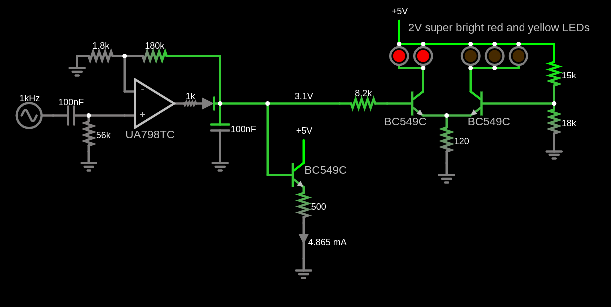
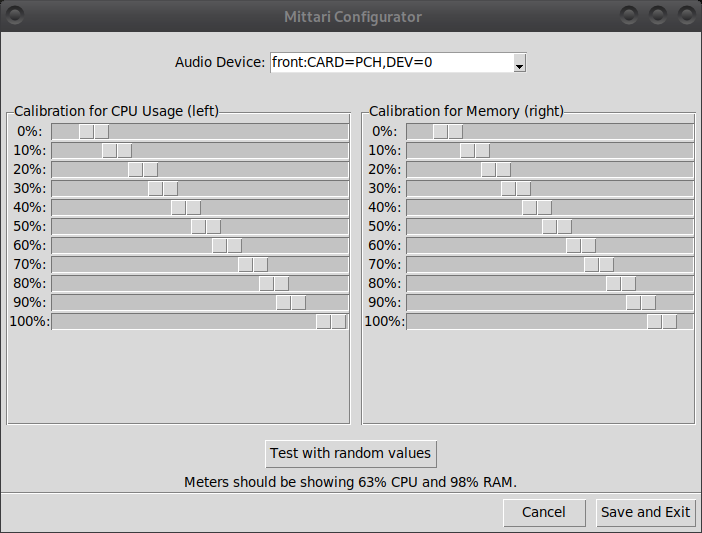

# Mittari

This electronics project is an analog CPU and RAM usage meter for my computer.
The idea is taken from [this youtube video](https://www.youtube.com/watch?v=4J-DTbZlJ5I).

TODO: picture of device outside

TODO: picture of device inside

The meters are controlled by sending audio out through the headphones jack.
This turned out to be the most convenient way to get a usable signal out of my computer.
Also, because the headphones jack supports stereo,
I conveniently get two channels (left and right) that I can use for the two meters.
This does mean that if I connect my headphones to the wrong place,
I will hear 1kHz beeping.

The actual meters are [this product from AliExpress](https://www.aliexpress.com/item/1005004735059319.html).
I used the 5mA version.


## Circuit Design

I designed an analog circuit to drive the meters and LEDs,
because I haven't yet learned to throw a microcontroller at every electronics problem.
Here is **one half** of the circuit, enough to drive one meter.
The other half is similar.



[Click here to open the circuit in CircuitJS.](https://www.falstad.com/circuit/circuitjs.html?ctz=CQAgjCAMB0l3BWEB2aA2MBOZAOBaFkAmbSQkBSCkAFgGYKBTAWjDACgAlEZuo8ZGh5oaAoVQhh4UWHRpIqi6AnYBjHnzHghYQVHCx4R43DAtkPGPDSZItsHWR06aRy4WGOAJ21awQoiJRKnx4dgBzX0DRfxAgxSh2AEMQEW0JGhi0KhxaaGDwExlIOhKcZGIaIhsRBAdLWCD5PDAabHlIHDoEBikjdgB3VJi9WN1xdh80zB1MkBn9MBx+qdEFqnXwZcgI-U22fkVB4fA56Ymh1rWdTH519gATdOesfn8qfgfGADMkgFcADYAFzU4FuL3B0UW5hAdFgNneYDqRDkSNwxUgHEirziQTB-Hi+h2l3B73x8wu5LJRHwzx2QLitJpQlKomZix4YGgmFKXUwOBo5QIAsCMlcIjkPTgmBoaC6QkoVC+v0BIO4rLiNCoGpxCS11ASMBUPg1RGIsMgoj4CUV7Ec2stsKIDqtcvARN2GpcuS9Ao9Q3Z1KZtOJjJ02VhCDeEaIXFommW8f4mj1ISJMhUDJoYwjsqyCQgzBg9BlMzQBFciuzYrlaCIOEw-KWkCCbAocBAyv+wPY-n4UdyiYH4DABM7P27QOYAMYTwgMHExQ4DJEEgjw7JEgaeEgTgcSKCCAQbVyRtsLf5RFeyFlOH7Ha7quOea0bR0elDb60G4-k1oC3Gf8An1CRnV2L9CQgkNEiGF9Ey-RNPwWId6xARC-2zcNtSjOk0OdHY+woCMhwjA44nHFVgWnWd3QXIlYA4QiEHBIdSVHcjHyomc5zFejMWODd2NCEdDgE0ihLY0ShmY-gSJyI5pOIkJUPQ6TUKuCh1PYgi61oNJ4LSMjPgnVVqJ4w0GN7XT6FkqgbJEjiTK4mj5z4jhYITOz9IUpMHJfMjP0M9j-LmUMZLQqhVwixIfDJOK5k3Qo4D-KLEyixKkTCVY10i-VnVPLYwkiKL8uGD48SOAAPWgzgYOULHLWhwCQIgADUAB0AGdOr+AAHRgvC6gAjLwAEtwgACyBLqvFnLqkgAOweLqAE9GABAEAHsBi6gAZABRAARTr2Gqgg4kgHRSguzAmqREAAFUAEFkH5AAVABhU6LRa49YQwRkLBiJAACEPuPTAvuq7M3gbPTchxYGQDBiGoc0mI4YQRNEea5HwbaL7Nv0ArRxIbV8hwfwqkoGUbF3RqrFMfQFFhU5WdFcrYXYImsDQxZun8W7GcxJcSmwUpnDIHldIgN5broO0CoAMVcpQyE5EBWs24EknCRh2CAA)

At a high-level, my circuit:
- removes any DC offset from the headphones signal (this seems to be unnecessary, but doesn't hurt)
- amplifies the input by 100x and stores the amplified max voltage into a capacitor
- uses a transistor connected as a voltage follower to drive the AliExpress current meter
- uses transistors to drive red or yellow LEDs (or both),
    depending on whether we are showing a value near 100%,
    using [this transistor trick](https://electronics.stackexchange.com/q/164068).

I used BC549C transistors and a UA798TC dual op-amp,
because I already had them.
With small modifications, you can use whatever parts are available to you.
Also, the resistor values don't need to match mine exactly.

The op-amp's output must go near the ground,
low enough to turn off the transistor driving the current meter can go down to 0mA.
In my build, the dual op-amp charges one 100nF capacitor to 270mV and the other to 400mV for some reason.
More than a diode drop (about 600mV) would be bad,
because the transistor that drives the current meter would never turn off,
so it would be impossible to make the meter go to zero.

The UA798TC does't swing all the way to +5V.
Because there is a 500 Ohm resistor in front of the transistor.
For example, at 3.7V, the meter will surely hit its maximum,
because there is enough voltage to
go through the diode (0.6V), turn on the transistor (0.6V)
and drive 5mA through the 500 Ohm resistor (2.5V).

The small 1k resistor at the output represents the op-amp's internal output resistance.
In reality it seems to be smaller than 1k.


## Software Setup

The software assumes that you have Linux.
The advantage of this is that it has no dependencies
except Python's standard library and development tools.
Let me know if you need to run the software on something else than Linux.

I made an ugly but useful GUI to compensate for electronics inaccuracies in software.

```
$ python3 -m mittari config
```

The GUI looks like this:



Once configured, you can start displaying CPU and memory usage:

```
$ python3 -m mittari
```

If you want to develop the software, you should probably start with these commands:

```
$ python3 -m venv
$ source env/bin/activate
$ pip install -r requirements-dev.txt
$ mypy mittari          # type checker
$ python3 -m pytest     # run tests
```
