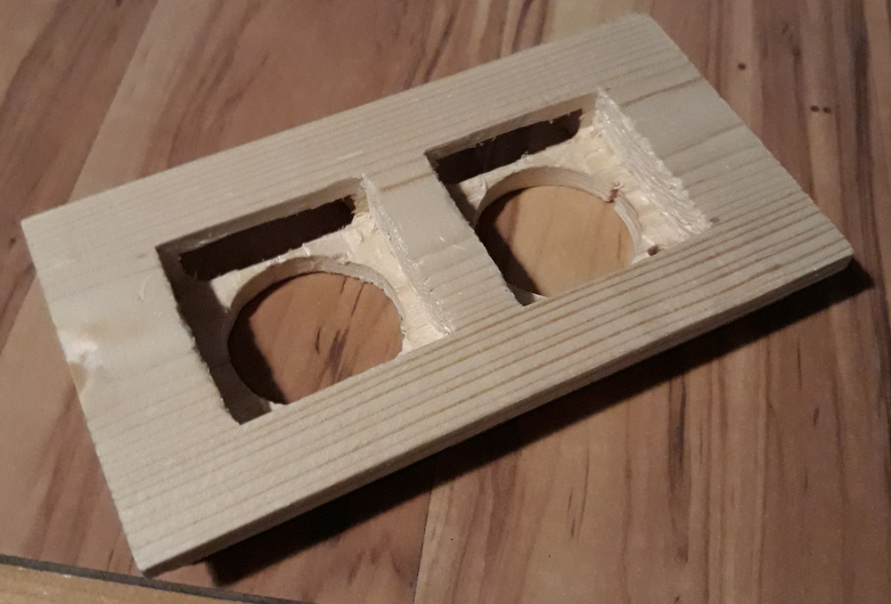

# Mittari

https://github.com/Akuli/mittari/assets/18505570/467ddbf9-522e-461b-a0d6-3eb654f96346

This project is an analog CPU and RAM meter for my computer.
The left meter is for CPU usage and the right is for RAM.
It involves woodworking, electronics, analog audio, digital audio, Python, tkinter, C, and a few other things.

The idea is taken from [this youtube video](https://www.youtube.com/watch?v=4J-DTbZlJ5I).


The meters are controlled by sending audio out through a USB sound card:
a louder audio makes a meter display a bigger value.
This turned out to be the easiest way to get data out of my computer.
Also, because the USB sound card outputs stereo audio,
I conveniently get two channels (left and right) that I can use for the two meters.
This does mean that if I connect my headphones to the wrong place,
I will hear a 1kHz sine wave.


## Meters


(Apparently they make current meters by adding a resistor to a voltage meter)

The meters are [this product from AliExpress](https://www.aliexpress.com/item/1005004735059319.html).
I used the 5mA version, so that the meters would consume much less current
than the 500mA limit of USB 2.0.

I am planning to scan the original mA scale with a scanner,
and then print custom scales onto paper and attach them on top of the original scale.
My custom scales will go from 0% to 100% instead of 0mA to 5mA,
and I will label them `CPU` and `RAM` instead of `mA`.


## Woodworking




I fitted the meters into a small leftover piece of spruce
using mostly a table saw, a drill press and a chisel.
I also cut slots for the LEDs.

After having the wooden part in my apartment for a few days,
it had dried and the meters didn't fit anymore.
I widened the meter holes by about 1mm in the direction across the grain.


## Power Cable and Fuse


I took the shortest USB 2.0 extension cord I found, sliced it open,
and soldered more wires onto it to get 5V power.
Doing this with USB 2.0 is super easy, because USB 2.0 cords have only 4 wires inside:
+5V (red), ground (black), and two data pins (D+ and D-).

I used a lot of shrink tube, because I don't want to break my computer by accidentally shorting these.

One end of the extension cord plugs into my computer (through a longer extension cord),
and the other end is for the USB sound card.

The black thingy at the end of the red cable is one half of
[this fuse holder that I already had](https://www.biltema.fi/en-fi/car---mc/electrical-system/fuses/line-fuse-holder-5-x-20-mm-2000048666).
I am using a fast 315mA fuse, because it works and I already had it.
I also tried a 63mA fuse, because the circuit seems to consume less than 50mA,
but it added too much resistance and the meters did not go all the way to 100%.


## USB Sound Card


I got this about 10 years ago. I don't remember why or where.
AliExpress sells very similar USB sound cards for about 2 euros each (includes shipping).


## Circuit Board


The board itself is [stripboard](https://en.wikipedia.org/wiki/Stripboard).
The black marks indicate where I cut the strips of copper on the other side.

I assembled this board almost entirely out of components I already had.
I think I only bought super-bright red LEDs.
The thing with a thick red cable is the other half of the fuse holder.

Each row of LEDs is yellow-red-yellow-red-yellow,
and the LEDs are aimed at the meters.
In hindsight, the black shrink tube around outermost LED legs is unnecessary.
I thought they would prevent the LED legs from touching the angle brackets that hold the board,
but when assembling this,
I ended up with a couple millimeters between the angle brackets and LED legs.

The audio cable is taken from cheap and broken earbuds.
The wires are covered in some kind of colorful insulation stuff that makes them difficult to solder.
It seems to burn away with a high temperature (I think I used 370-400 celsius) and a lot of time (15+ seconds).

The `layout.diy` file in this repo is a [DIY Layout Creator](https://diy-fever.com/software/diylc/) drawing of the board.


## Circuit Design


I designed an analog circuit to drive the meters and LEDs,
because I haven't yet learned to throw a microcontroller at every electronics problem.
Here is **one half** of the circuit, enough to drive one meter and one row of LEDs.
The other half is similar.

The repository contains [a circuitjs file](./mittari.circuitjs.txt)
that you can open with [circuitjs](https://www.falstad.com/circuit/circuitjs.html).
Alternatively, if you don't want to clone this repository,
copy the file's content and paste them to "Import from Text" in circuitjs.

Here is a walk-through of the circuit:

- The audio signal is passed through a high-pass filter (100nF cap and 56k resistor).
    In hindsight, this is unnecessary,
    because the audio coming from the USB sound card does not have any DC offset.
    The cutoff frequency of the filter is `1/(2*pi*R*C) ≈ 28 Hz`,
    so it will easily let my 1kHz sine wave through.
- The two diodes (1N4148) protect the op-amp from large input voltages
    in case I accidentally touch the audio cable to +5V, for example.
- The op-amp (UA798TC) is basically a non-inverting amplifier with gain `1 + 180k/1.8k ≈ 100`,
    but because of the diode at its output,
    it can only increase the output voltage, not decrease it.
    This causes the circuit to compute the maximum (peak) value of the audio signal.
    The small 1k resistor represents the internal output resistance of the op-amp.
- The 100nF cap after the op-amp remembers the maximum voltage of the input signal.
    For some reason, my 100nF caps get 270mV on one channel and 400mV on the other channel
    when there is no audio coming in.
    I'm not sure why that happens, but it doesn't really matter
    as long as these weird voltages aren't enough to turn on the transistors.
    With a 1kHz input signal, these capacitors need to remember the voltage accurately enough for about 1ms.
    Because the current gain of a BC549C transistor is about 500,
    and because the LEDs and the meter only consume about `20mA + 5mA`,
    the capacitor discharges with current `25mA / 500 = 50uA`.
    In one millisecond, the voltage changes by about `1/C ∫ I dt = (50uA * 1ms) / 100nF = 0.5V`.
    This sounds bad, but I just compensate for this (and other inaccuracies) in software.
    I could use a bigger cap or a higher frequency,
    but I had lots of 100nF caps and I wanted to use them,
    and 1kHz seems to work fine.
- The current meter (bottom of picture) is driven through a BC549C transistor,
    connected as a voltage follower, and a 470 ohm resistor.
    The meter displays its maximum value of 5mA
    when the transistor gets an average voltage of `470ohm * 5mA + 0.6V ≈ 3V` at its base.
    In practice, this voltage will bounce between about 2.75V and 3.25V because of the 0.5V discharging.
    This doesn't matter, because the meter isn't fast enough to move along with the varying voltage.
- The LED transistors use [this transistor trick](https://electronics.stackexchange.com/q/164068)
    to turn on either yellow or red LEDs depending on the voltage.
    The two transistors basically act as a comparator,
    comparing the output of the op-amp to `18k/(12k+18k) * 5V = 3V`
    given by the voltage divider on the right.
    The red LEDs begin to turn at about 75%,
    and there's almost no yellow light when a meter is displaying 100%.


## Supported operating system

The software reads `/proc/stat` and `/proc/meminfo` (both Linux-specific) to get CPU and RAM usage,
and sends audio data to an `aplay` subprocess (also Linux-specific).
This means that the software will not work on anything other than Linux.

The advantage is that there are no dependencies except development tools and Python's standard library.
To me, this seems like a better option than supporting platforms that I won't use anyway.
If I added Windows or MacOS support, it would probably be broken most of the time.


## Python and Tkinter


I made an ugly but useful Python script with a tkinter GUI.
The main purpose is compensating for electronics inaccuracies in software.
There are several inaccuracies:
- Transistors need about 0.6V to turn on.
- The AliExpress current meters are inaccurate.
- The circuit depends on the current gain (beta) of the transistors.
- I used +-5% resistors and capacitors, and also a couple +-10% capacitors.

But none of this matters if the software can output the correct audio volumes
to set the meters to the right places.

Each slider sets the audio volume used to move the meter to a given position.
For example, the 20% sliders should be adjusted so that the meter displays 20%
when that slider is hovered.
Then, to display a value like 27%, the software will output a sine wave
whose volume is a weighted average of the positions of the 20% and 30% sliders.
In other words, it uses linear interpolation.
As you hover or drag the sliders, the meter shows the value set by the slider,
so that you know where the slider should be.

Running the config script:

```
$ sudo apt install python3-tk
$ python3 config.py my-mittari-config.conf
```

Here `my-mittari-config.conf` is the name of a config file
that is in a completely non-standard format.
It will be created if it doesn't exist.
The repository contains [example-config.conf](./example-config.conf),
so you can get an idea of what a config file looks like without running anything.

Developing the config script:

```
$ python3 -m venv env
$ source env/bin/activate
$ pip install -r requirements-dev.txt
$ mypy config.py        # type checker
$ python3 -m pytest     # run tests
```


## C

Once I have a config file, I run a C program to display my CPU and memory usage:

```
$ make
$ ./mittari my-mittari-config.conf
```

I originally wrote this part in Python,
but I rewrote it in C because the Python version always consumed a couple percent of CPU.

The C program is quite simple, in principle.
It spawns an `aplay` subprocess and then feeds audio data to its stdin in chunks of 0.1 seconds.
(The 0.1 can be changed by editing the config file manually.)

I made sure to properly handle situations where `aplay` or my C program lag:
- If my C program lags, `aplay` will stop playing for a moment and print a warning.
    This is fine, but unlikely to ever happen in practice.
    My C program only writes a chunk of audio data every 0.1 seconds,
    so it is idle most of the time.
- If `aplay` lags, my C program will get stuck at writing data to its stdin until the lag is over.
    To ensure that this happens, I
    [set the pipe buffer size as small as possible](https://stackoverflow.com/a/14371183).

When timing the 0.1 seconds, I made sure to take into account the time spent in lags:
- If the C program spends 0.01 seconds between two sleeps,
    then the second sleep will be 0.09 seconds instead of 0.1 seconds
- If the C program spends more than 0.1 seconds between two sleeps,
    then the second sleep is skipped entirely.

The SIGSTOP and SIGCONT signals are useful for testing the lag:

```
$ pkill -STOP aplay
$ pkill -CONT aplay
```
